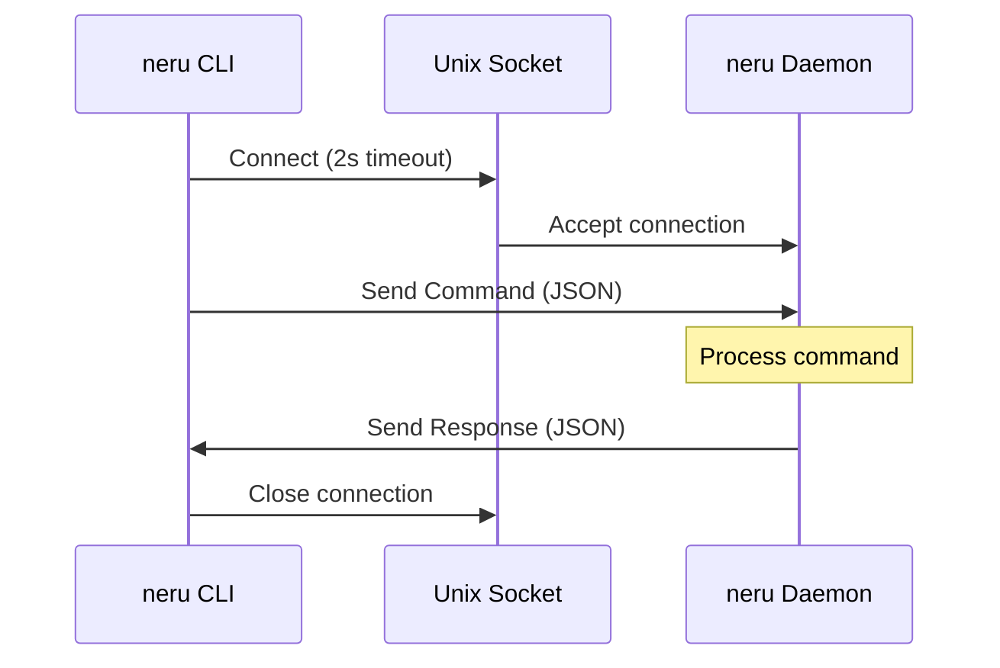

Neru uses Unix domain sockets for fast, reliable inter-process communication (IPC) between the CLI and daemon. This page documents the IPC protocol, message formats, and implementation details.

## Overview

The IPC system enables:

- **Fast communication** - Unix sockets in OS temp directory
- **Multiple concurrent connections** - Non-blocking command execution
- **Structured messaging** - JSON-based request/response protocol
- **Error handling** - Typed error codes for programmatic handling
- **Version compatibility** - Protocol version negotiation

<CardGroup cols={2}>
  <Card title="Socket Location" icon="plug">
    `/var/folders/.../T/neru.sock`
  </Card>
  <Card title="Protocol Version" icon="tag">
    `1.0.0`
  </Card>
  <Card title="Default Timeout" icon="clock">
    5 seconds
  </Card>
  <Card title="Socket Permissions" icon="lock">
    `0600` (user only)
  </Card>
</CardGroup>

---

## Architecture

### Communication Flow



### Socket Path

The socket is created in the OS temporary directory:

```go
// internal/core/infra/ipc/ipc.go:92
func SocketPath() string {
    tmpDir := os.TempDir()
    return filepath.Join(tmpDir, "neru.sock")
}
```

**Typical paths:**

- **macOS:** `/var/folders/[random]/T/neru.sock`
- **Linux:** `/tmp/neru.sock`
- **Windows:** (Planned) Named pipe support

---

## Message Format

### Command Structure

All commands sent from CLI to daemon use this JSON structure:

```json
{
  "version": "1.0.0",
  "action": "hints",
  "params": {},
  "args": []
}
```

<ParamField path="version" type="string">
  Protocol version (currently `1.0.0`). Used for version negotiation.
</ParamField>

<ParamField path="action" type="string" required>
  Command to execute (e.g., `hints`, `grid`, `start`, `stop`, `action`)
</ParamField>

<ParamField path="params" type="object">
  Optional command parameters as key-value pairs
</ParamField>

<ParamField path="args" type="array">
  Optional command arguments as string array
</ParamField>

### Response Structure

All responses from daemon to CLI use this JSON structure:

```json
{
  "version": "1.0.0",
  "success": true,
  "message": "OK",
  "code": "OK",
  "data": {}
}
```

<ParamField path="version" type="string">
  Protocol version of the server
</ParamField>

<ParamField path="success" type="boolean" required>
  Whether the command succeeded
</ParamField>

<ParamField path="message" type="string">
  Human-readable success or error message
</ParamField>

<ParamField path="code" type="string">
  Machine-readable status/error code (see [Response Codes](#response-codes))
</ParamField>

<ParamField path="data" type="any">
  Optional response payload (structure varies by command)
</ParamField>

---

## Response Codes

Standard response codes for programmatic error handling:

### Success Codes

| Code | Description |
|------|-------------|
| `OK` | Command executed successfully |

### Error Codes

| Code | Description | Common Cause |
|------|-------------|-------------|
| `ERR_UNKNOWN_COMMAND` | Invalid command | Typo or unsupported action |
| `ERR_NOT_RUNNING` | Daemon not running | Daemon stopped or crashed |
| `ERR_ALREADY_RUNNING` | Daemon already running | Attempted duplicate launch |
| `ERR_MODE_DISABLED` | Navigation mode disabled | Mode disabled in config file |
| `ERR_INVALID_INPUT` | Invalid parameters | Missing or malformed arguments |
| `ERR_ACTION_FAILED` | Action execution failed | System error or permission issue |
| `ERR_VERSION_MISMATCH` | Protocol version mismatch | CLI/daemon version incompatibility |

From `internal/core/infra/ipc/ipc.go:45`

---

## Command Examples

### Navigation Mode

Activate hints mode:

<CodeGroup>
```json Request
{
  "version": "1.0.0",
  "action": "hints",
  "params": {},
  "args": ["hints"]
}
```

```json Response (Success)
{
  "version": "1.0.0",
  "success": true,
  "message": "Hints mode activated",
  "code": "OK"
}
```

```json Response (Disabled)
{
  "version": "1.0.0",
  "success": false,
  "message": "Hints mode is disabled in configuration",
  "code": "ERR_MODE_DISABLED"
}
```
</CodeGroup>

### Navigation with Action

Activate hints mode with right-click action:

<CodeGroup>
```json Request
{
  "version": "1.0.0",
  "action": "hints",
  "params": {},
  "args": ["hints", "right_click"]
}
```

```json Response
{
  "version": "1.0.0",
  "success": true,
  "message": "Hints mode activated with action: right_click",
  "code": "OK"
}
```
</CodeGroup>

### Immediate Action

Perform left click at current cursor position:

<CodeGroup>
```json Request
{
  "version": "1.0.0",
  "action": "action",
  "params": {},
  "args": ["left_click"]
}
```

```json Response
{
  "version": "1.0.0",
  "success": true,
  "message": "Action executed: left_click",
  "code": "OK"
}
```
</CodeGroup>

### Mouse Movement

Move mouse to absolute coordinates:

<CodeGroup>
```json Request
{
  "version": "1.0.0",
  "action": "action",
  "params": {},
  "args": ["move_mouse", "--x=500", "--y=300"]
}
```

```json Response
{
  "version": "1.0.0",
  "success": true,
  "message": "Mouse moved to (500, 300)",
  "code": "OK"
}
```
</CodeGroup>

### Status Query

Query daemon status:

<CodeGroup>
```json Request
{
  "version": "1.0.0",
  "action": "status",
  "params": {},
  "args": []
}
```

```json Response
{
  "version": "1.0.0",
  "success": true,
  "message": "Status retrieved",
  "code": "OK",
  "data": {
    "enabled": true,
    "mode": "idle",
    "config": "/Users/username/.config/neru/config.toml"
  }
}
```
</CodeGroup>

### Config Dump

Retrieve current configuration:

<CodeGroup>
```json Request
{
  "version": "1.0.0",
  "action": "config",
  "params": {},
  "args": []
}
```

```json Response
{
  "version": "1.0.0",
  "success": true,
  "message": "Configuration retrieved",
  "code": "OK",
  "data": {
    "hint": {
      "enabled": true,
      "labels": "asdfjkl",
      "overlay_style": {
        "background_color": "#FFD700",
        "text_color": "#000000"
      }
    },
    "grid": {
      "enabled": true,
      "rows": 5,
      "columns": 5
    }
  }
}
```
</CodeGroup>

---

## Timeouts & Concurrency

### Timeout Configuration

From `internal/core/infra/ipc/ipc.go:20`:

```go
const (
    // DefaultTimeout is the default timeout for IPC operations
    DefaultTimeout = 5 * time.Second
    
    // ConnectionTimeout is the timeout for establishing a connection
    ConnectionTimeout = 2 * time.Second
    
    // ConnectionReadTimeout is the timeout for reading from a connection
    ConnectionReadTimeout = 30 * time.Second
    
    // PingTimeout is the timeout for ping operations
    PingTimeout = 500 * time.Millisecond
)
```

**Override default timeout:**

```bash
neru --timeout 10 hints
```

### Concurrent Connections

The IPC server handles multiple concurrent CLI commands:

- Each connection spawns a new goroutine
- Commands are processed sequentially by the daemon
- No command queueing - responses are immediate

**Example:**

```bash
# These run concurrently without blocking
neru status &
neru config dump &
wait
```

---

## Server Implementation

The daemon creates an IPC server on startup:

```go
// From internal/core/infra/ipc/ipc.go:99
func NewServer(handler CommandHandler, logger *zap.Logger) (*Server, error) {
    socketPath := SocketPath()
    
    // Remove existing socket if it exists
    os.Remove(socketPath)
    
    // Create listener
    listenConfig := &net.ListenConfig{}
    listener, err := listenConfig.Listen(context.Background(), "unix", socketPath)
    if err != nil {
        return nil, err
    }
    
    // Set socket permissions (user only)
    os.Chmod(socketPath, 0600)
    
    return &Server{
        listener:   listener,
        logger:     logger,
        handler:    handler,
        socketPath: socketPath,
    }, nil
}
```

### Connection Handling

Each connection is processed in a separate goroutine:

```go
// From internal/core/infra/ipc/ipc.go:207
func (s *Server) handleConnection(connection net.Conn) {
    defer connection.Close()
    
    // Set read deadline
    connection.SetDeadline(time.Now().Add(ConnectionReadTimeout))
    
    // Decode command
    decoder := json.NewDecoder(connection)
    var cmd Command
    if err := decoder.Decode(&cmd); err != nil {
        // Send error response
        return
    }
    
    // Validate protocol version
    if cmd.Version != "" && cmd.Version != ProtocolVersion {
        // Send version mismatch response
        return
    }
    
    // Execute command via handler
    response := s.handler(ctx, cmd)
    response.Version = ProtocolVersion
    
    // Encode response
    encoder := json.NewEncoder(connection)
    encoder.Encode(response)
}
```

---

## Client Implementation

The CLI creates a client to send commands:

```go
// From internal/core/infra/ipc/ipc.go:315
func (c *Client) SendWithTimeout(cmd Command, timeout time.Duration) (Response, error) {
    // Create dialer with timeout
    dialer := net.Dialer{Timeout: ConnectionTimeout}
    ctx, cancel := context.WithTimeout(context.Background(), timeout)
    defer cancel()
    
    // Connect to socket
    connection, err := dialer.DialContext(ctx, "unix", c.socketPath)
    if err != nil {
        return Response{}, err
    }
    defer connection.Close()
    
    // Set deadline
    connection.SetDeadline(time.Now().Add(timeout))
    
    // Encode and send command
    encoder := json.NewEncoder(connection)
    if cmd.Version == "" {
        cmd.Version = ProtocolVersion
    }
    if err := encoder.Encode(cmd); err != nil {
        return Response{}, err
    }
    
    // Decode response
    decoder := json.NewDecoder(connection)
    var response Response
    if err := decoder.Decode(&response); err != nil {
        return Response{}, err
    }
    
    return response, nil
}
```

---

## Health Check

Check if the daemon is running:

```go
// From internal/core/infra/ipc/ipc.go:425
func IsServerRunning() bool {
    client := NewClient()
    _, err := client.SendWithTimeout(Command{Action: "ping"}, PingTimeout)
    return err == nil
}
```

**CLI usage:**

```bash
neru status &>/dev/null && echo "Running" || echo "Not running"
```

---

## Error Handling

### Client-Side Errors

**Connection timeout:**

```json
{
  "error": "connection timeout: neru may be unresponsive",
  "code": "TIMEOUT"
}
```

**Connection failed:**

```json
{
  "error": "failed to connect to neru (is it running?)",
  "code": "IPC_FAILED"
}
```

### Server-Side Errors

**Invalid JSON:**

```json
{
  "version": "1.0.0",
  "success": false,
  "message": "failed to decode command: invalid JSON",
  "code": "ERR_INVALID_INPUT"
}
```

**Version mismatch:**

```json
{
  "version": "1.0.0",
  "success": false,
  "message": "protocol version mismatch: client=0.9.0, server=1.0.0",
  "code": "ERR_VERSION_MISMATCH"
}
```

---

## Troubleshooting

### Socket Permission Denied

**Problem:** Cannot connect to socket due to permissions.

**Solution:**

```bash
# Check socket permissions
ls -l /var/folders/*/*/T/neru.sock

# Should be: srw------- (0600)
# If not, remove and restart daemon
rm -f /var/folders/*/*/T/neru.sock
neru launch
```

### Stale Socket

**Problem:** Socket exists but daemon is not running.

**Solution:**

```bash
# Remove stale socket
rm -f $(find /var/folders -name "neru.sock" 2>/dev/null)

# Restart daemon
neru launch
```

### Connection Timeout

**Problem:** Commands hang or timeout.

**Solution:**

```bash
# Increase timeout
neru --timeout 30 hints

# Check daemon logs
tail -f ~/Library/Logs/neru/app.log

# Force restart if unresponsive
pkill -9 neru
neru launch
```

### Monitor IPC Traffic

For debugging, you can monitor IPC traffic:

```bash
# Watch daemon logs for IPC messages
tail -f ~/Library/Logs/neru/app.log | grep "Received command"

# Example output:
# 2026-03-13T10:23:45.123Z INFO Received command {"action": "hints", "trace_id": "abc123"}
```

---

## Advanced Usage

### Custom IPC Client

You can implement your own IPC client in any language that supports Unix sockets:

<CodeGroup>
```python Python
import socket
import json
import os

def send_command(action, args=[]):
    sock_path = os.path.join(os.environ.get('TMPDIR', '/tmp'), 'neru.sock')
    
    client = socket.socket(socket.AF_UNIX, socket.SOCK_STREAM)
    client.settimeout(5.0)
    
    try:
        client.connect(sock_path)
        
        # Send command
        cmd = {
            "version": "1.0.0",
            "action": action,
            "args": args
        }
        client.sendall(json.dumps(cmd).encode() + b'\n')
        
        # Receive response
        data = client.recv(4096)
        response = json.loads(data)
        
        return response
    finally:
        client.close()

# Usage
response = send_command("hints", ["hints", "left_click"])
print(response)
```

```javascript Node.js
const net = require('net');
const os = require('os');
const path = require('path');

function sendCommand(action, args = []) {
  return new Promise((resolve, reject) => {
    const sockPath = path.join(os.tmpdir(), 'neru.sock');
    const client = net.createConnection(sockPath);
    
    client.on('connect', () => {
      const cmd = {
        version: '1.0.0',
        action: action,
        args: args
      };
      client.write(JSON.stringify(cmd) + '\n');
    });
    
    client.on('data', (data) => {
      const response = JSON.parse(data.toString());
      resolve(response);
      client.end();
    });
    
    client.on('error', reject);
    client.setTimeout(5000, () => {
      client.destroy();
      reject(new Error('Timeout'));
    });
  });
}

// Usage
sendCommand('hints', ['hints', 'left_click'])
  .then(response => console.log(response))
  .catch(error => console.error(error));
```
</CodeGroup>

---

## Next Steps

<CardGroup cols={2}>
  <Card title="CLI Commands" icon="terminal" href="/cli/commands">
    Complete CLI command reference
  </Card>
  <Card title="Scripting & Automation" icon="code" href="/cli/scripting">
    Integrate Neru with skhd and scripts
  </Card>
</CardGroup>
