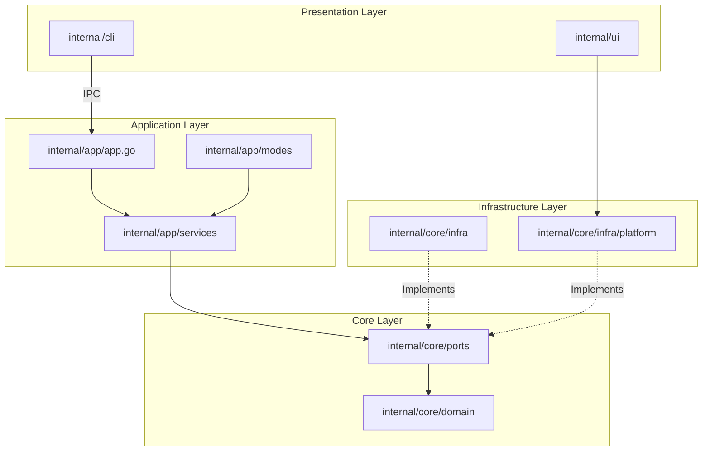
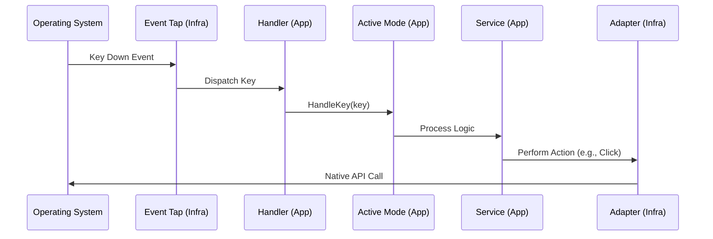

Neru is built using a **Hexagonal Architecture** (also known as Ports and Adapters) pattern, ensuring clean separation between business logic and platform-specific implementations. This architecture enables cross-platform support while maintaining a deep integration with native OS APIs.

## Core Design Principles

Neru's architecture follows four fundamental principles:

### 1. Shared Business Logic

All core logic (hint generation, grid calculations, mode transitions) is written in pure Go and lives in platform-agnostic layers:

- `internal/core/domain` - Pure business entities and logic
- `internal/app/services` - Application orchestration

### 2. Platform Isolation

OS-specific code is strictly isolated. **Non-darwin code must never import macOS-specific packages.** This rule is enforced by `golangci-lint` using `depguard`.

<Note>
**The One Rule**: Non-darwin-tagged code must never import `internal/core/infra/platform/darwin`. This ensures cross-platform compatibility and prevents CGo dependencies from polluting non-macOS builds.
</Note>

### 3. Ports and Adapters

System capabilities are defined as interfaces (Ports) and implemented as concrete adapters:

- **Ports** (interfaces): `internal/core/ports/`
- **Adapters** (implementations): `internal/core/infra/`

### 4. Build Tag Separation

OS-specific files use Go build tags to ensure compilation only for target platforms:

```go
//go:build darwin

package darwin
// macOS-specific implementation
```

## Layer Architecture



### Layer Responsibilities

<CardGroup cols={2}>
  <Card title="Domain Layer" icon="cube">
    Pure business logic and entities with no external dependencies.
    
    - `internal/core/domain/hint/` - Hint generation logic
    - `internal/core/domain/grid/` - Grid calculations
    - `internal/core/domain/element/` - UI element models
  </Card>

  <Card title="Ports Layer" icon="plug">
    Interface contracts defining system capabilities.
    
    - `accessibility.go` - UI element discovery and actions
    - `system.go` - Screen, cursor, and permissions
    - `overlay.go` - UI overlay rendering
  </Card>

  <Card title="Application Layer" icon="gears">
    Orchestrates domain entities and services.
    
    - `internal/app/app.go` - Application lifecycle
    - `internal/app/modes/` - Navigation modes
    - `internal/app/services/` - Business orchestration
  </Card>

  <Card title="Infrastructure Layer" icon="server">
    Platform-specific implementations of ports.
    
    - `internal/core/infra/accessibility/` - Accessibility adapter
    - `internal/core/infra/platform/darwin/` - macOS implementations
    - `internal/core/infra/platform/linux/` - Linux implementations
  </Card>
</CardGroup>

## System Overview

Neru operates as a background daemon that provides multiple navigation modes:

<CardGroup cols={2}>
  <Card title="Hints Mode" icon="tags">
    Overlays unique character labels on clickable UI elements for keyboard-driven navigation.
  </Card>

  <Card title="Grid Mode" icon="grid">
    Divides the screen into a coordinate-based grid system for precise cursor positioning.
  </Card>

  <Card title="Scroll Mode" icon="arrows-up-down">
    Provides Vim-style scrolling at the current cursor position.
  </Card>

  <Card title="Recursive Grid Mode" icon="sitemap">
    Enables recursive cell navigation with center preview and backtracking.
  </Card>
</CardGroup>

## Codebase Navigation

To understand how Neru works, follow the path of an event from the OS to the user action:

### 1. Entry Points

- `cmd/neru/main_darwin.go` - Bootstraps the application, locking the main thread for Cocoa
- `internal/cli/root.go` - Cobra root command for the CLI

### 2. Application Wiring

- `internal/app/app_initialization.go` - Orchestrates startup phases
- `internal/app/app_initialization_steps.go` - Detailed initialization steps

### 3. The Platform Factory

The factory pattern isolates OS-specific code:

- `internal/core/infra/platform/factory.go` - Abstract factory interface
- `internal/core/infra/platform/factory_darwin.go` - macOS factory (with build tag)
- `internal/core/infra/platform/factory_linux.go` - Linux factory (with build tag)

These return the correct `ports.SystemPort` implementation without polluting shared code with OS-specific imports.

### 4. Input Processing Flow



**Flow Details:**

1. **OS Level**: `eventtap_darwin.m` captures low-level keyboard events
2. **Infrastructure Level**: `adapter.go` receives events and dispatches to app
3. **Application Level**: `handler.go` routes keys to the active Mode
4. **Service Level**: Mode calls services like `hint_service.go` for business logic

## Coordinate Systems

Neru uses a **global top-left (0,0) coordinate system** for all shared logic:

- **Origin**: (0,0) is the top-left corner of the primary display
- **Y-Axis**: Increases downwards
- **Units**: Screen pixels (unscaled)

<Note>
**macOS Coordinate Inversion**: macOS Cocoa APIs use a bottom-left (0,0) system where Y increases upwards. The darwin platform adapter (`accessibility_screen_darwin.m`) handles coordinate conversion before passing values to shared Go code.
</Note>

## Error Handling

Neru uses a custom error package `internal/core/errors` for structured error handling:

### CodeNotSupported Policy

When a platform-specific feature isn't implemented, adapters return:

```go
return derrors.New(derrors.CodeNotSupported, "feature X not yet implemented on linux")
```

### Graceful Degradation

Service layer code uses `IsNotSupported(err)` to handle missing features gracefully:

```go
if err != nil {
    if derrors.IsNotSupported(err) {
        logger.Warn("Feature not available on this platform")
        return nil
    }
    return err
}
```

## Technology Stack

<CardGroup cols={3}>
  <Card title="Core Language" icon="golang">
    **Go 1.26+**
    
    Cross-platform systems programming
  </Card>

  <Card title="Native Bridge" icon="apple">
    **CGo + Objective-C**
    
    macOS Cocoa integration
  </Card>

  <Card title="CLI Framework" icon="terminal">
    **Cobra**
    
    Command-line interface
  </Card>

  <Card title="Configuration" icon="file-code">
    **TOML**
    
    User configuration files
  </Card>

  <Card title="IPC" icon="exchange">
    **Unix Domain Sockets**
    
    Daemon communication
  </Card>

  <Card title="Build System" icon="hammer">
    **Just**
    
    Build automation
  </Card>
</CardGroup>

## Performance Considerations

### Event Tap Latency

The event tap callback is extremely lean to prevent system-wide keyboard lag. Heavy processing is deferred to Go routines.

### Accessibility Caching

Querying the macOS Accessibility API is expensive. Neru implements intelligent caching in `internal/core/infra/accessibility/cache.go` to minimize IPC overhead.

### Native Rendering

Overlays use native Cocoa APIs for GPU-accelerated, flicker-free UI rendering.

## Security Architecture

<CardGroup cols={2}>
  <Card title="Secure Input Detection" icon="lock">
    Neru detects when "Secure Input" is enabled (e.g., password fields) and automatically suspends the event tap to prevent unintended key logging.
  </Card>

  <Card title="Minimal Permissions" icon="shield">
    Neru requests only the minimum set of permissions needed for UI interaction. On macOS, this is limited to Accessibility permissions.
  </Card>

  <Card title="IPC Security" icon="user-lock">
    Unix domain sockets are created with restricted file permissions, ensuring only the current user can communicate with the daemon.
  </Card>

  <Card title="No Data Collection" icon="eye-slash">
    Neru processes all keyboard events locally and never transmits user data over the network.
  </Card>
</CardGroup>

## Next Steps

<CardGroup cols={2}>
  <Card title="Hexagonal Design" href="/development/hexagonal-design" icon="hexagon">
    Deep dive into the Ports and Adapters pattern
  </Card>

  <Card title="Cross-Platform" href="/development/cross-platform" icon="laptop-code">
    Learn about platform-specific implementations
  </Card>
</CardGroup>