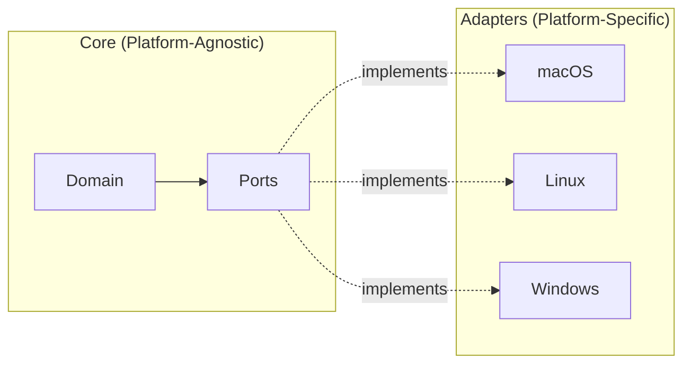
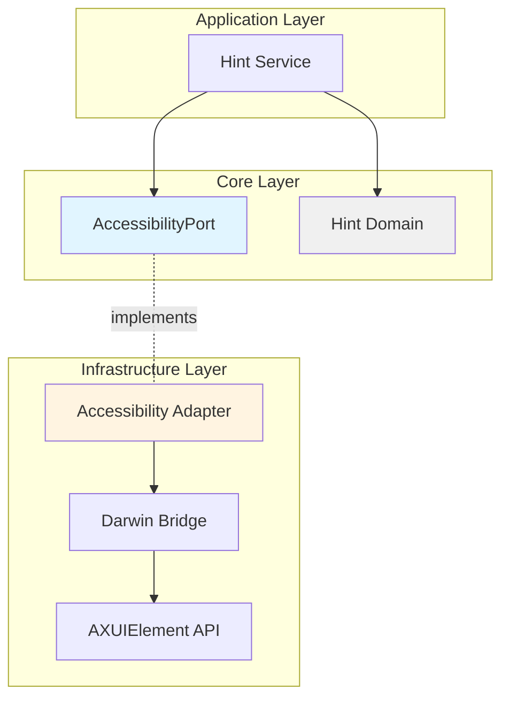

Neru implements the **Hexagonal Architecture** pattern (also called Ports and Adapters) to achieve clean separation between business logic and platform-specific code. This design enables cross-platform support while maintaining deep integration with native OS APIs.

## What is Hexagonal Architecture?

Hexagonal Architecture organizes code into layers where:

- **Core business logic** is isolated from external dependencies
- **Ports** define abstract interfaces for external systems
- **Adapters** provide concrete implementations for specific platforms



## The Ports Layer

### Location

```
internal/core/ports/
├── accessibility.go    # UI element discovery and actions
├── config.go          # Configuration management
├── health.go          # Health check interface
├── infrastructure.go   # Infrastructure bundle
├── overlay.go         # UI overlay rendering
├── system.go          # Screen, cursor, permissions
└── tracer.go          # Observability
```

### Port Interfaces

Ports define **what** the system can do, without specifying **how**:

#### AccessibilityPort

Defines capabilities for interacting with UI elements:

```go
// internal/core/ports/accessibility.go

type AccessibilityPort interface {
    HealthCheck
    ElementDiscovery
    ActionExecution
    ApplicationInfo
}

type ElementDiscovery interface {
    // ClickableElements retrieves all clickable UI elements
    ClickableElements(ctx context.Context, filter ElementFilter) ([]*element.Element, error)
}

type ActionExecution interface {
    // PerformAction executes an action on the specified element
    PerformAction(ctx context.Context, elem *element.Element, actionType action.Type) error
    
    // PerformActionAtPoint executes an action at the specified point
    PerformActionAtPoint(ctx context.Context, actionType action.Type, point image.Point) error
    
    // Scroll performs a scroll action
    Scroll(ctx context.Context, deltaX, deltaY int) error
}

type ApplicationInfo interface {
    // FocusedAppBundleID returns the platform application identifier
    FocusedAppBundleID(ctx context.Context) (string, error)
    
    // IsAppExcluded checks if the application is in the exclusion list
    IsAppExcluded(ctx context.Context, bundleID string) bool
}
```

<Note>
**Interface Segregation**: Notice how `AccessibilityPort` is composed of smaller, focused interfaces. This follows the Interface Segregation Principle, making it easier to test and mock specific behaviors.
</Note>

#### SystemPort

Defines system-level capabilities:

```go
// internal/core/ports/system.go

type SystemPort interface {
    HealthCheck
    FileSystemPort
    ProcessPort
    ScreenManagement
    PermissionManagement
    ThemeProviderPort
    SecureInputPort
    
    ShowAlert(ctx context.Context, title, message string) error
    ShowNotification(title, message string)
}

type ScreenManagement interface {
    ScreenBounds(ctx context.Context) (image.Rectangle, error)
    MoveCursorToPoint(ctx context.Context, point image.Point, bypassSmooth bool) error
    CursorPosition(ctx context.Context) (image.Point, error)
}

type FileSystemPort interface {
    ConfigDir() (string, error)
    UserDataDir() (string, error)
    LogDir() (string, error)
}
```

#### OverlayPort

Defines UI overlay rendering capabilities:

```go
// internal/core/ports/overlay.go

type OverlayPort interface {
    HealthCheck
    
    ShowHints(ctx context.Context, hints []*hint.Interface) error
    ShowGrid(ctx context.Context) error
    Show()
    Hide(ctx context.Context) error
    
    DrawModeIndicator(x, y int)
    IsVisible() bool
    Refresh(ctx context.Context) error
}
```

## The Adapters Layer

### Location

```
internal/core/infra/
├── accessibility/         # Accessibility adapter
│   ├── adapter.go        # Implements AccessibilityPort
│   └── cache.go          # Element caching
├── platform/
│   ├── factory.go        # Abstract factory
│   ├── factory_darwin.go # macOS factory (build-tagged)
│   ├── factory_linux.go  # Linux factory (build-tagged)
│   ├── darwin/           # macOS implementations
│   │   ├── system.go     # SystemPort for macOS
│   │   ├── accessibility.go
│   │   ├── overlay_darwin.m
│   │   └── ...
│   ├── linux/            # Linux implementations
│   │   └── system.go     # SystemPort for Linux
│   └── windows/          # Windows implementations
│       └── system.go     # SystemPort for Windows
└── hotkeys/
    ├── manager_darwin.go # macOS hotkey manager
    └── manager_stub.go   # Stub for other platforms
```

### Platform Factory Pattern

The factory pattern isolates platform-specific imports:

```go
// internal/core/infra/platform/factory.go
package platform

import "errors"

var ErrUnsupportedPlatform = errors.New("unsupported platform")

// NewSystemPort is implemented in build-tagged files
```

```go
//go:build darwin

package platform

import (
    "github.com/y3owk1n/neru/internal/core/infra/platform/darwin"
    "github.com/y3owk1n/neru/internal/core/ports"
)

func NewSystemPort() (ports.SystemPort, error) {
    return darwin.NewSystemAdapter(), nil
}
```

<Note>
**Build Tags**: The factory uses build tags (`//go:build darwin`) to ensure each platform only compiles its own adapter. This prevents CGo dependencies from affecting Linux/Windows builds.
</Note>

### macOS Adapter Example

The macOS adapter implements `SystemPort`:

```go
//go:build darwin

package darwin

import (
    "context"
    "image"
    "os"
    "path/filepath"
    
    derrors "github.com/y3owk1n/neru/internal/core/errors"
    "github.com/y3owk1n/neru/internal/core/ports"
)

type SystemAdapter struct{}

func NewSystemAdapter() *SystemAdapter {
    return &SystemAdapter{}
}

// ConfigDir returns the macOS-specific configuration directory
func (s *SystemAdapter) ConfigDir() (string, error) {
    home, err := os.UserHomeDir()
    if err != nil {
        return "", err
    }
    return filepath.Join(home, "Library", "Application Support", "neru"), nil
}

// ScreenBounds returns the bounds of the active screen
func (s *SystemAdapter) ScreenBounds(ctx context.Context) (image.Rectangle, error) {
    // Calls Objective-C bridge function
    return ActiveScreenBounds(), nil
}

// IsDarkMode returns true if macOS Dark Mode is active
func (s *SystemAdapter) IsDarkMode() bool {
    return IsDarkMode()
}

// Ensure SystemAdapter implements ports.SystemPort
var _ ports.SystemPort = (*SystemAdapter)(nil)
```

### Linux Adapter Example

The Linux adapter implements the same interface with stubs:

```go
package linux

import (
    "context"
    "image"
    "os"
    "path/filepath"
    
    derrors "github.com/y3owk1n/neru/internal/core/errors"
    "github.com/y3owk1n/neru/internal/core/ports"
)

type SystemAdapter struct{}

func NewSystemAdapter() *SystemAdapter {
    return &SystemAdapter{}
}

// ConfigDir returns the Linux-specific configuration directory
func (s *SystemAdapter) ConfigDir() (string, error) {
    home, err := os.UserHomeDir()
    if err != nil {
        return "", err
    }
    return filepath.Join(home, ".config", "neru"), nil
}

// ScreenBounds is not yet implemented on Linux
func (s *SystemAdapter) ScreenBounds(ctx context.Context) (image.Rectangle, error) {
    return image.Rectangle{}, derrors.New(
        derrors.CodeNotSupported,
        "ScreenBounds not yet implemented on linux",
    )
}

// IsDarkMode returns false on Linux (not yet implemented)
func (s *SystemAdapter) IsDarkMode() bool {
    return false
}

var _ ports.SystemPort = (*SystemAdapter)(nil)
```

## Dependency Flow



### Example: Hint Generation Flow

1. **Application Layer** - `hint_service.go` calls:
   ```go
   elements, err := accessibilityPort.ClickableElements(ctx, filter)
   ```

2. **Port Interface** - `AccessibilityPort` defines the contract

3. **Adapter** - `accessibility/adapter.go` implements the interface:
   ```go
   func (a *Adapter) ClickableElements(ctx context.Context, filter ports.ElementFilter) ([]*element.Element, error) {
       // Platform-specific implementation
       return a.queryElements(ctx, filter)
   }
   ```

4. **Platform Bridge** - On macOS, calls Objective-C code:
   ```go
   elements := darwin.GetClickableElements()
   ```

5. **Native API** - Objective-C calls AXUIElement API

## Real-World Examples

### Example 1: Cross-Platform Configuration Directories

**Port Definition:**

```go
// internal/core/ports/system.go
type FileSystemPort interface {
    ConfigDir() (string, error)
}
```

**macOS Adapter:**

```go
// Returns: ~/Library/Application Support/neru
func (s *SystemAdapter) ConfigDir() (string, error) {
    home, err := os.UserHomeDir()
    if err != nil {
        return "", err
    }
    return filepath.Join(home, "Library", "Application Support", "neru"), nil
}
```

**Linux Adapter:**

```go
// Returns: ~/.config/neru
func (s *SystemAdapter) ConfigDir() (string, error) {
    home, err := os.UserHomeDir()
    if err != nil {
        return "", err
    }
    return filepath.Join(home, ".config", "neru"), nil
}
```

**Windows Adapter:**

```go
// Returns: %APPDATA%\neru
func (s *SystemAdapter) ConfigDir() (string, error) {
    return filepath.Join(os.Getenv("APPDATA"), "neru"), nil
}
```

### Example 2: Application Identification

**Port Definition:**

```go
type ApplicationInfo interface {
    // Returns platform-specific application identifier
    FocusedAppBundleID(ctx context.Context) (string, error)
}
```

**Platform Differences:**

| Platform | Identifier Type | Example |
|----------|----------------|----------|
| macOS | Bundle ID | `com.apple.Safari` |
| Linux | Desktop ID | `firefox.desktop` |
| Windows | AppUserModelID | `Microsoft.Edge` |

<Note>
The same `FocusedAppBundleID()` method returns different identifier formats on each platform. Application code doesn't need to know about these differences - it just works with the abstract "bundle ID" concept.
</Note>

### Example 3: Overlay Rendering

**Port Definition:**

```go
type OverlayPort interface {
    ShowHints(ctx context.Context, hints []*hint.Interface) error
    Hide(ctx context.Context) error
}
```

**macOS Implementation:**

Uses native Cocoa NSWindow for GPU-accelerated rendering:

```go
func (o *OverlayAdapter) ShowHints(ctx context.Context, hints []*hint.Interface) error {
    // Calls Objective-C to create native windows
    darwin.RenderHintOverlays(hints)
    return nil
}
```

**Linux Implementation (Future):**

Will use X11 or Wayland overlays:

```go
func (o *OverlayAdapter) ShowHints(ctx context.Context, hints []*hint.Interface) error {
    // Will use X11 overlay windows or Wayland layer-shell
    return derrors.New(derrors.CodeNotSupported, "overlays not yet implemented on linux")
}
```

## Benefits of This Architecture

<CardGroup cols={2}>
  <Card title="Testability" icon="vial">
    Business logic can be tested without OS-specific dependencies. Mock implementations of ports enable fast unit testing.
  </Card>

  <Card title="Cross-Platform" icon="laptop-code">
    New platform support requires only implementing adapters. Business logic remains unchanged.
  </Card>

  <Card title="Maintainability" icon="wrench">
    Clear boundaries between layers make it easy to understand and modify code. Platform-specific code is isolated.
  </Card>

  <Card title="Flexibility" icon="arrows-split-up-and-left">
    Swap implementations without affecting application code. For example, mock adapters for testing.
  </Card>
</CardGroup>

## The "One Rule"

<Warning>
**Critical Constraint**: Non-darwin-tagged code must **never** import `internal/core/infra/platform/darwin`.

This rule is enforced by `golangci-lint` using `depguard`. Violations will cause CI failures.
</Warning>

### Why This Rule Exists

1. **Prevents CGo pollution**: Darwin package uses CGo and Objective-C, which would break Linux/Windows builds
2. **Enforces architecture**: Ensures all platform code goes through ports
3. **Build speed**: Keeps non-macOS builds fast by avoiding CGo

### How to Follow This Rule

Use the factory pattern:

```go
// ✅ CORRECT - Using factory
import "github.com/y3owk1n/neru/internal/core/infra/platform"

systemPort, err := platform.NewSystemPort()
```

```go
// ❌ WRONG - Direct import
import "github.com/y3owk1n/neru/internal/core/infra/platform/darwin"

adapter := darwin.NewSystemAdapter() // CI will fail!
```

## Next Steps

<CardGroup cols={2}>
  <Card title="Cross-Platform Guide" href="/development/cross-platform" icon="laptop-code">
    Learn how to add platform support
  </Card>

  <Card title="Architecture Overview" href="/development/architecture" icon="sitemap">
    Return to high-level architecture
  </Card>
</CardGroup>